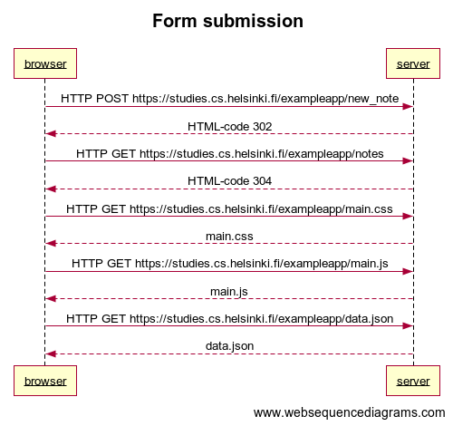
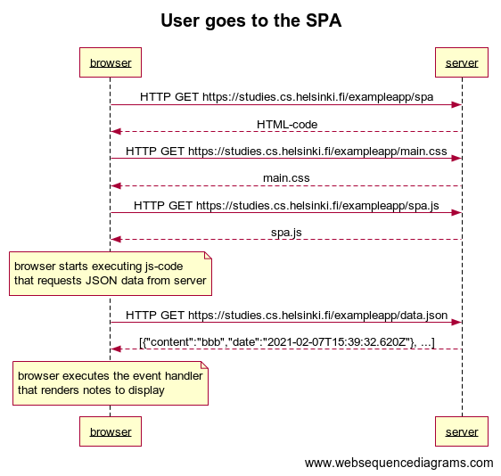

# [part0 exercises](https://fullstackopen.com/en/part0/fundamentals_of_web_apps#exercises-0-1-0-6)

  * ## 0.1 HTML
    review [_HTML tutorial_](https://developer.mozilla.org/en-US/docs/Learn/Getting_started_with_the_web/HTML_basics)

  * ## 0.2 CSS
    [_CSS tutorial_](https://developer.mozilla.org/en-US/docs/Learn/Getting_started_with_the_web/CSS_basics)

  * ## 0.3 HTML forms
    [Your first from](https://developer.mozilla.org/en-US/docs/Learn/HTML/Forms/Your_first_HTML_form)

  * ## 0.4 new note
    ### note. I had to reset Chrome devtool to be able to record the sequence properly
    
  
  * ## 0.5: Single page app
    

  * ## 0.6: New note
    